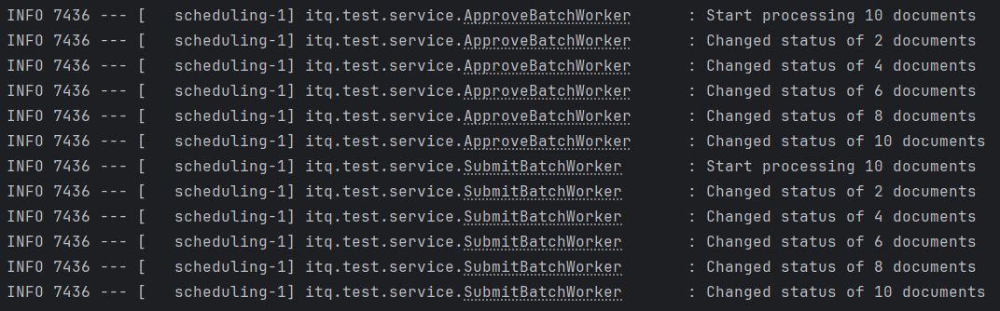

docker compose up -d

# запускаем api
./gradlew :api:bootRun 

# генерируем документы(размер меняется в properties)
./gradlew :generator:bootRun

./gradlew :worker:bootRun

поиск в api сделан по дате создания

Как показываются логи:

Добавить kafka для обработки большого количества сообщений
Реестр утверждений в виде отдельного http-сервиса, если нагрузка на бд из-за основного приложения будет слишком большой тогда отдельную бд

